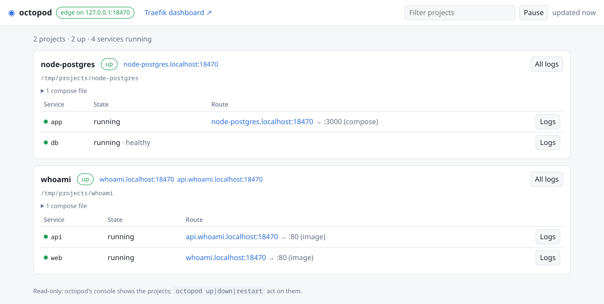

# octopod

[](https://www.npmjs.com/package/@quazardous/octopod)
[](https://github.com/quazardous/octopod/actions/workflows/ci.yml)
[](./LICENSE)
[](https://nodejs.org)

> One local edge for all your Docker projects: a shared Traefik, declared projects and isolated networks — behind a small API.

On a development machine, every Docker project grows its own Traefik, its own labels, its
own ports. They fight over port 80, one Traefik adopts another project's routes, and each
project repeats the same traps in its own compose file. octopod does that part once, for
the whole machine.

- **One edge for every project.** A single Traefik on loopback serves each project at
  `http://<project>.localhost` (and `http://<name>.<project>.localhost`). No DNS, no
  `/etc/hosts`, no certificates: `*.localhost` resolves to your machine, and browsers treat
  it as a secure context.
- **Projects stay plain.** A project keeps its own compose file and adds a small
  `octopod.yaml` that says what to expose. octopod generates the labels, the routes and the
  networks. No Traefik label is written by hand.
- **Projects are isolated.** Each has its own internal edge network: Traefik reaches every
  project, and projects cannot reach each other.
- **A container you can walk into.** `octopod shell` opens a shell in a service, as its
  user, in its working directory, or as root without sudo in the image.
- **A console.** `http://octopod.localhost` shows every project, the state of its services,
  their URLs and their logs.
- **Data in the project, nothing owned by root.** Named volumes are kept in the project's
  `.octopod/data`, created as you. A service that runs or writes there as root is reported.
- **Or no compose file at all.** A project can name recipes (`node-app`, `php-app`,
  `postgres`, `mariadb`) instead.

octopod is only infrastructure: Traefik and Docker composition. It knows nothing about
what runs in your containers, and adds no variable to the services of your own compose
files. Recipes are the one place where variables are passed: a recipe you chose hands its
address to another (`DATABASE_URL` from `postgres` to `node-app`).

## Why not…

- **ddev, Lando, Laravel Valet?** They manage the stack: the language runtime, the
  database, the tools, in their own format. octopod manages the edge — routing, networks,
  where the data lives — and leaves your compose files as they are: they still run with
  `docker compose` alone (the data octopod kept in `.octopod/data` stays where it is).
- **A Traefik you set up yourself?** That is what octopod runs, with what each project
  would otherwise write by hand: the labels, a network per project so projects cannot
  reach each other, a filter on an exact label so another Traefik's containers are never
  adopted, the data kept in the project, and a console.

## Quick start

You need Linux, Docker with Compose v2 (`docker compose`), and Node.js 22 or later.

```sh
npm i -g @quazardous/octopod
octopod setup      # checks Docker, runs the API as a user service, starts the edge
```

Or from a clone: `git clone https://github.com/quazardous/octopod && cd octopod && ./setup.sh`.

Then try an example:

```sh
cd examples/whoami       # in a clone, or copy the folder
octopod up               # registers the project the first time
```

Open `http://whoami.localhost` and `http://api.whoami.localhost`, then
`http://octopod.localhost` for the console. If port 80 was taken, the edge is on 8480, and
the URLs carry `:8480`: `octopod edge status` gives them.

## Your project

Next to your compose file, an `octopod.yaml`:

```yaml
project: demo            # optional: the folder's name by default
group: shop              # optional: the console groups projects by it (and tags: [php, legacy])
expose:
  - service: web         # → http://demo.localhost
  - service: api
    host: api            # → http://api.demo.localhost
    port: 8080           # optional: found in the compose file or the image otherwise
```

Or no compose file at all, only recipes:

```yaml
services:
  app: { recipe: node-app }   # npm run dev, at http://<project>.localhost
  db:  { recipe: postgres }   # its URL handed to the app as DATABASE_URL
```

The app's image gets a user named after the project, at your uid, and nothing installed in
it: its dependencies are the project's (`octopod shell -- npm install`). The user is the
image's own, renamed and moved to your uid when the image is built — `node-app` starts from
`node:22-bookworm-slim` for that reason: alpine images have no `usermod`. `octopod plan`
shows what `up` would run, and `octopod recipes` lists the recipes. You can add your own
recipe folders with `OCTOPOD_RECIPES`, `recipes:` in `octopod.yaml`, or the project's
`.octopod/recipes/`; `octopod recipes --check` reads their Dockerfiles against octopod's rules.

See [`examples/`](./examples) for both kinds.

## Commands

```sh
octopod up                    # start the edge if needed, then the project (registered the first time)
octopod register [dir]        # declare a project without starting it
octopod status                # its services, URLs and warnings
octopod list --group shop     # the registered projects (--tag php, too)
octopod logs --service web --tail 100
octopod shell [service]       # a shell in a service, as its user; --root; -- command…
octopod restart [--service s]
octopod down                  # --volumes removes Docker's volume objects; the data stays
octopod up --instance 2       # the same project a second time, at demo-2.localhost
octopod unregister <project>
octopod edge status           # the edge, the console and the dashboard's addresses
octopod version
```

Commands run in a project's folder act on that project; elsewhere, name it
(`octopod status demo`). All but `shell` take `--json`. The same operations are an HTTP API on a unix
socket (`octopod serve`), for other tools: see [docs/CONTRACT.md](./docs/CONTRACT.md).

## The console



`http://octopod.localhost` lists every project and instance, the state and health of each
service, their URLs, what octopod warns about, and the logs, which it refreshes. It is
read-only, and links to Traefik's dashboard at `http://traefik.localhost`. Both answer only
from your machine, never from a project's container. The console reads the API, which
`octopod setup` runs as the `octopod` systemd user service.

## How it works

- **The edge** is one Traefik container, published on `127.0.0.1:80` (or 8480). It reads
  the Docker socket read-only, and only considers containers carrying its own label, so
  other Traefiks on the machine and their containers are left alone.
- **`octopod up`** runs `docker compose` with your files plus a generated override that
  adds, to each exposed service, the routing labels and the project's edge network. The
  override lives in octopod's state directory, not in your project.
- **Data**: each named volume of the project is bound to `.octopod/data/<volume>`, which
  is git-ignored. The data is deleted with the project, not with a `docker volume prune`.

The lessons behind these choices are in [docs/PATTERNS.md](./docs/PATTERNS.md).

## Status

0.1 is a preview. It is tested on Linux with Docker; Docker Desktop (macOS, Windows) and
rootless Docker are not tested yet. Until 1.0, the contract may change between minor
versions; every change is in the [changelog](./CHANGELOG.md), and a breaking one says what
to do. The plan is in [docs/ROADMAP.md](./docs/ROADMAP.md).

## Contributing, security, license

[CONTRIBUTING.md](./CONTRIBUTING.md) · [SECURITY.md](./SECURITY.md) · MIT, see
[LICENSE](./LICENSE).
